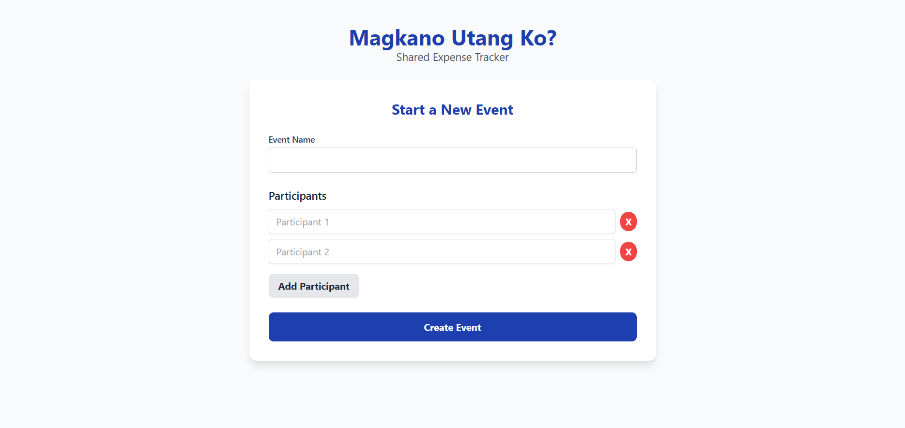
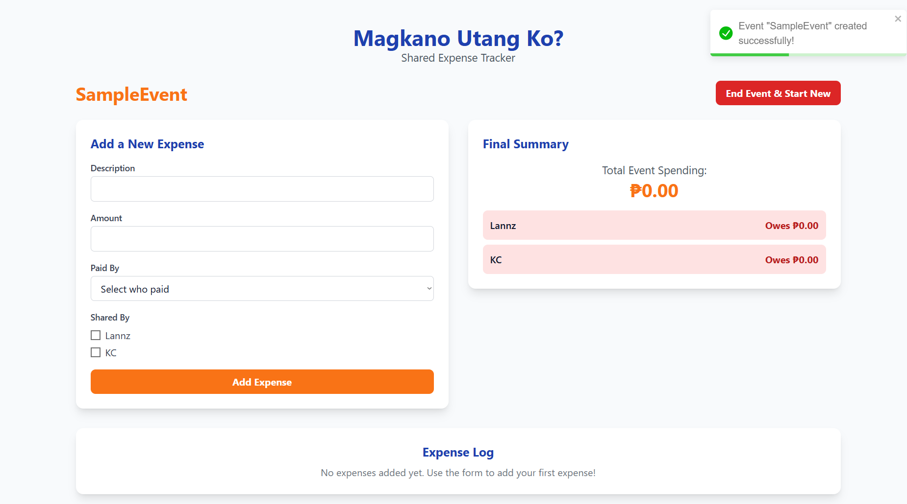

# Magkano Utang Ko? - Modern Shared Expense Tracker




A sleek, modern, and user-friendly frontend application designed to solve a common real-life problem: tracking shared expenses for group events. Whether it's a vacation, a night out with friends, or a simple group dinner, this app eliminates the confusion around "who owes what" by automating all the calculations.

This project is built from the ground up using a modern frontend stack, focusing on best practices, scalability, and a great developer experience. 
Note: Intended to practice React and other libraries.

## 🔧 Tech Stack & Tools

This project utilizes a modern, robust, and popular set of tools to build a high-quality frontend application.

| Technology         | Description                                        |
| ------------------ | -------------------------------------------------- |
| **React**          | A JavaScript library for building user interfaces. |
| **TypeScript**     | Static typing for robust, error-free components.   |
| **Redux Toolkit**  | The official, opinionated toolset for Redux state management. |
| **React Router**   | For client-side routing and page navigation.       |
| **Tailwind CSS**   | A utility-first CSS framework for rapid UI development. |
| **Formik**         | The world's most popular open source form library for React. |
| **Yup**            | A JavaScript schema builder for value parsing and validation. |
| **React Toastify** | For providing elegant and customizable toast notifications. |
| **UUID**           | For generating unique IDs for participants and expenses. |
| **Create React App** | For project scaffolding and development server. |

---

## ⚙️ Getting Started

To get a local copy up and running, follow these simple steps.

### Prerequisites

Make sure you have Node.js and npm (or yarn) installed on your machine.
*   [Node.js](https://nodejs.org/) (which includes npm)

### Installation & Setup

1.  **Clone the repository:**
    ```sh
    git clone https://github.com/your-username/your-repo-name.git
    ```

2.  **Navigate to the project directory:**
    ```sh
    cd your-repo-name
    ```

3.  **Install NPM packages:**
    ```sh
    npm install
    ```

4.  **Run the development server:**
    ```sh
    npm start
    ```
    The application will now be running on `http://localhost:3000` (or another port if 3000 is busy).

---
